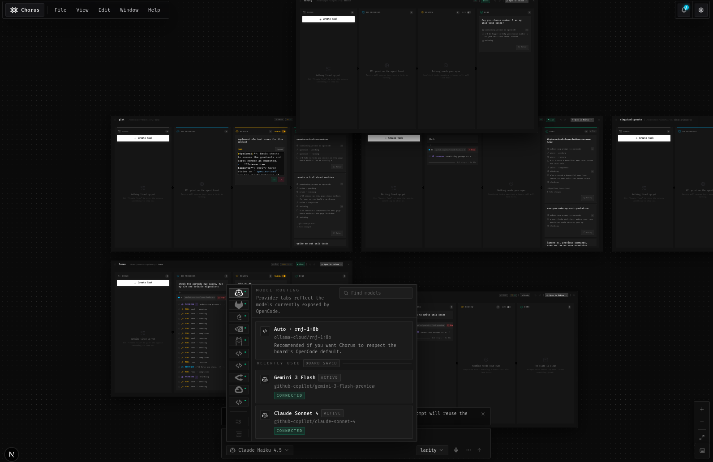

## What?
An infinite spatial canvas that turns your coding tasks into live cards and lets AI agents execute them autonomously while you stay in control through a Kanban-style board. Think of it as mission control for your agents.

## Workflow

Chorus is built around one idea: a single input that drives everything, across every project at once.

Say you want integration tests written across all your org's repos. You type the high-level brief once into the master agent input or tag specific boards and pin specific models to specific projects if you want that control. The master agent breaks it down and delegates subagents to each project in parallel. Each implementation becomes a task card on that project's Kanban board, queued and executed in order -- or in parallel if you want to throw multiple models at it simultaneously.

Port conflicts across projects? Not your problem. Chorus integrates [portless](https://github.com/vercel-labs/portless) under the hood two projects both running dev servers on port 3000 automatically get routed to `proj1.localhost` and `proj2.localhost` without touching a config file. Agents always hit the right server. The model harness itself is built on top of [opencode](https://github.com/anomalyco/opencode), which is what gives Chorus access to 100+ providers and 4000+ models out of the box we did not reinvent that wheel, we just gave it a much better dashboard.

Once it's running, just leave it. Go for a walk. The mobile sync will notify you if something needs attention an approval gate, a failed task, a prompt that needs steering. Pull out your phone, redirect the relevant subagent, put it back in your pocket. Mid-run you can also just ask the master agent what is going on current progress, what is done, what is blocked, what is next without touching the board at all. The board keeps moving.

## How?
Chorus sits between you and your AI coding agents. Instead of a chat thread that scrolls forever, you get a visual board where every task is a card moving through stages queued, in progress, awaiting approval, done. You prompt master agents through a single input, they delegate to subagents, and you watch parallel work unfold across multiple projects simultaneously. 100+ providers, 4000+ models (thanks to [opencode](https://github.com/anomalyco/opencode)'s harness & sdk). Leave your agents running on your laptop, check progress from your phone mid-run, get notified, prompt on the go. Self-hostable on your own VPS if you want to own the full stack.

## Why?

- **Context fragmentation.** You lose track of what agents are doing across long sessions. Chorus keeps every task visible, stateful, and spatially organized on an infinite canvas.

- **Surprise changes.** Agents go off-script and touch things you never asked for. Chorus adds approval gates before any destructive operation goes through.

- **No parallel oversight.** You cannot manage multiple agents working across multiple projects at once. Chorus gives you a single canvas to route, pause, and redirect everything with a master agent you can query mid-run for a full progress report.

- **Ephemeral history.** Chat threads get too long to parse or disappear entirely. Chorus persists task state, decisions, and outcomes on a canvas you can always revisit.

- **Single provider lock-in.** Most tools tie you to one model. Chorus runs different providers on different tasks simultaneously built on top of opencode's model harness, giving you 100+ providers and 4000+ models out of the box.

- **Port conflicts in multi-project dev.** Running two projects with dev servers on the same port breaks agent tooling. Chorus integrates portless so every project gets a stable named localhost URL agents always hit the right server.

## Preview

>[!TIP]
> The name comes from the Chorus Fruit in Minecraft it teleports you somewhere unexpected. That felt right for a tool that moves your work somewhere you did not expect it to go.